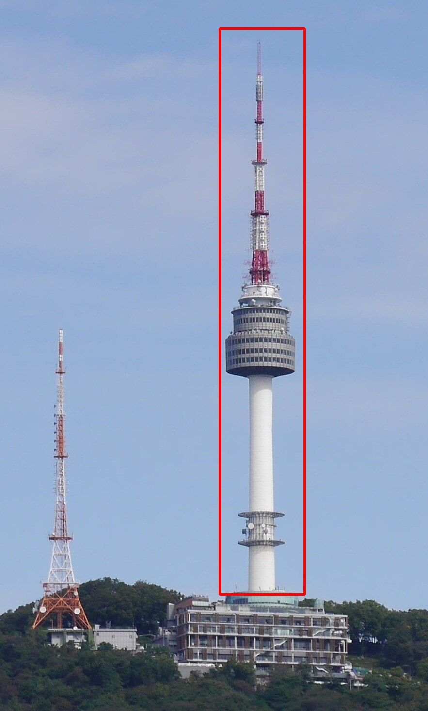

# N-Seoul Tower Detect program
- 숭실대학교 컴퓨터학부 컴퓨터비전 수업 과제(송현주 교수님)
- 자세한 내용은 report.pdf 참조
- 규칙 기반으로 문제 해결을 시도했다면 어떤 성능이 나왔을까?(how?)

# Outline
- 입력 이미지가 입력되면, 이미지 내부에 N-Seoul Tower 객체 여부를 판단하는 프로그램 작성
- N-Seoul Tower가 있다면 Red Bounding Box로 결과 이미지를 생성(result.jpg)
- N-Seoul Tower가 없다면 None 출력

# Demo
1. n-seoul tower 객체가 이미지에 있는 경우
<br>


2. n-seoul tower 객체가 이미지에 없는 경우

# Usage
1. Repository clone
```
git clone https://github.com/jeonseoknam/n-tower-yolo.git
cd n-tower-yolo
```
2. Virtual environment 생성
```
python3 -m venv .venv
source .venv/bin/activate
```
3. 필요 패키지 설치
```
pip install -r requirements.txt
```
4. 이후 Command 참조하여 프로그램 사용

# Command
1. N-Seoul Tower 존재 여부 확인
```
python3 main.py --input path/to/image.jpg --task presence
```

2. N-Seoul Tower 위치(좌표) 출력
```
python3 main.py --input path/to/image.jpg --task bbox
```

3. N-Seoul Tower 바운딩 박스 이미지까지 생성
```
python3 main.py --input path/to/image.jpg --task bbox --vis_output
```

# Include Packages
- Numpy 2.2.6
- opencv-python 4.12.0.88
- ultratics

# Reference
https://docs.opencv.org/
<br>
https://numpy.org/doc/
<br>
https://docs.python.org/3/library/argparse.html
<br>
